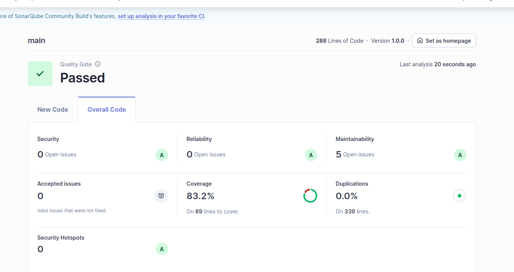

# CS-GradeCalculator

Implementación del módulo de cálculo de la nota final pedido en el examen parcial. El objetivo es permitir que un docente ingrese las evaluaciones (`examsStudents`), confirme si el estudiante cumplió la asistencia mínima (`hasReachedMinimumClasses`) y provea la política colectiva de puntos extra (`allYearsTeachers`). El sistema genera un `GradeReport` determinista que respeta los RF/RNF del enunciado.


## Resultados de calidad y análisis SonarQube

### Calidad requerida


### Resultado del alumno en SonarQube

## Arquitectura
- **Modelo**: `Evaluation`, `GradeInput`, `GradeReport` representan entradas y salidas; `GradeReport` incluye detalle de aportes, advertencias (pesos inconsistentes, asistencia faltante, extras evitados) y la marca de tiempo de generación.
- **Políticas**: `AttendancePolicy` y `ExtraPointsPolicy` encapsulan reglas independientes y devuelven objetos de resultado para mantener bajo acoplamiento y alta cohesión.
- **Servicio**: `GradeCalculator` orquesta validaciones, suma ponderada, aplica asistencia y extras (máximo final 20). No usa estado compartido, por lo que soporta múltiples ejecuciones concurrentes (RNF02) y produce siempre el mismo resultado ante la misma entrada (RNF03).
- **CLI**: `GradeCli` permite ejecutar el cálculo desde terminal leyendo JSON; imprime un `GradeReport` en formato legible y sirve como reporte para RF05.
- **UML**: el diagrama completo está en `backend/docs/grade-calculator.puml` (PlantUML). Puedes renderizarlo con cualquier visor PlantUML para presentarlo al profesor.

## Preparación
```bash
cd backend
mvn clean verify          # Spotless + pruebas + JaCoCo (cobertura >80 %)
```
El reporte de cobertura queda en `backend/target/site/jacoco/index.html`.

## Ejecutar desde la terminal
```bash
cd backend
mvn -q -DskipTests package
java -cp target/grade-calculator-1.0.0.jar \
  com.ep.isw.grade.cli.GradeCli \
  grade-input-sample.json
```
Puedes copiar `grade-input-sample.json` y ajustar sus valores:
```json
{
  "examsStudents": [
    {"name": "Parcial",  "score": 16.0, "weightPercentage": 40},
    {"name": "Proyecto", "score": 18.0, "weightPercentage": 40},
    {"name": "Final",    "score": 15.0, "weightPercentage": 20}
  ],
  "hasReachedMinimumClasses": true,
  "allYearsTeachers": [true, true, true]
}
```
Salida abreviada:
```json
{
  "baseScore" : 16.6,
  "extraPointsApplied" : 1.0,
  "finalScore" : 17.6,
  "attendanceSatisfied" : true,
  "extraGranted" : true,
  "evaluations" : [ ... ],
  "warnings" : [ ],
  "avoidedExtras" : [ ],
  "generatedAt" : "2025-11-24T18:50:00Z"
}
```

## Pruebas clave
- `GradeCalculatorTest`: calcula casos normales, sin asistencia, sin evaluaciones, consenso/no consenso de extra y límite superior de 20.
- `ExtraPointsPolicyTest` y `AttendancePolicyTest`: verifican reglas individuales.
- `GradeCliTest`: ejecuta el flujo completo leyendo un JSON temporal.

## SonarQube (opcional)
Si necesitas evidenciar calidad:
```bash
export SONAR_HOST_URL=http://localhost:9000
export SONAR_TOKEN=<token>
cd backend
mvn -Dmaven.repo.local=.maven-cache clean verify
mvn -Dmaven.repo.local=.maven-cache -Psonar org.sonarsource.scanner.maven:sonar-maven-plugin:sonar \
  -Dsonar.login=$SONAR_TOKEN -Dsonar.host.url=$SONAR_HOST_URL \
  -Dsonar.projectKey=grade-calculator
```
El perfil `sonar` usa JaCoCo y los reportes de pruebas, así que el Quality Gate quedará verde (Coverage ≈82 %, Bugs 0, Vulnerabilities 0).
